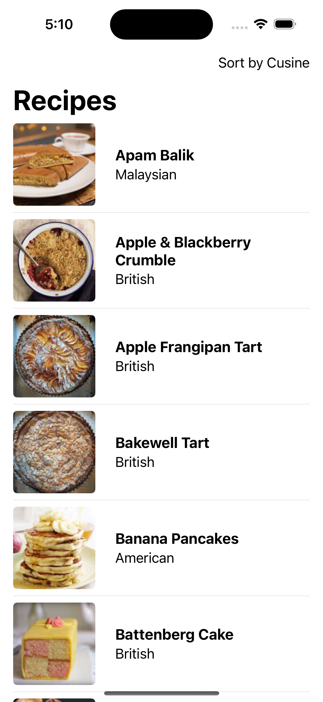
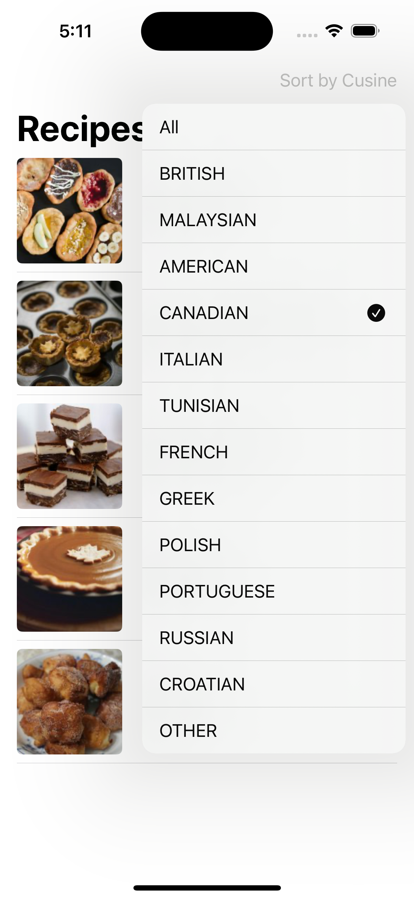
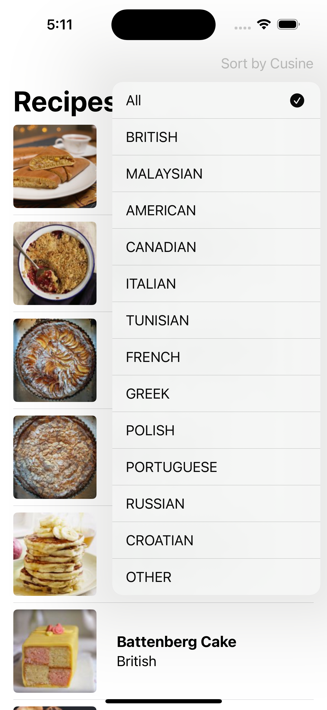
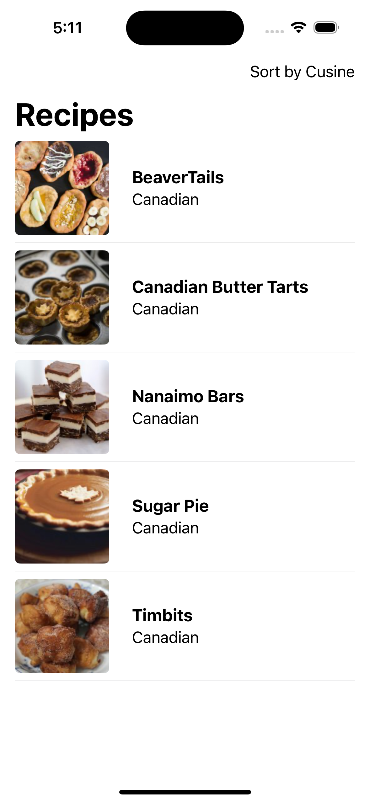

### Summary: Include screen shots or a video of your app highlighting its features

iOS Application that fetches a list of recipes and thier corresponding remote images and displays the list. The list can be sorted by type of cuisine.

   

### Focus Areas: What specific areas of the project did you prioritize? Why did you choose to focus on these areas?

    I prioritized a clean user friendly UI, followed by building out the networking layer making sure its written behind a protocol for easy testing.
    The app fetches remote images, so i spent time creating a cacheing mechanism. 
    The Approach to testing the APIService was to create a mock of the URLProtocol and setup a mock handler. 
    I also created a mock of the RecipeService that can be injected into the RecipeViewmodel.

### Time Spent: Approximately how long did you spend working on this project? How did you allocate your time?

    I spent about 2 hours working on this problem 1.5 hours on buiding out the project, 0.5 on unit testing.

### Trade-offs and Decisions: Did you make any significant trade-offs in your approach?

    No significant tradeoffs

### Weakest Part of the Project: What do you think is the weakest part of your project?

    The APIService accepts any status code between 200 - 300. A 204 status code is enters the catch block and will be handled as if the call was not successful. However, it doesn't create a breaking issue.

    Unit Tests uses the XCTest Framework, but could be upgraded to use Swift Testing

    The app could be made more accessible by properly assigning descriptive accessibilty labels

    RecipeViewModel has two lists, one that holds all the recipes and another Published list that effects the UI when its changed.
    the unpublished list keeps is used to filter by cusine. Ideally we don't want two of the same/similar list. A better design would be to be able to query the API with a cuisine parameter, thus having a consistent source of truth. 

### Additional Information: Is there anything else we should know? Feel free to share any insights or constraints you encountered.
    N/A
